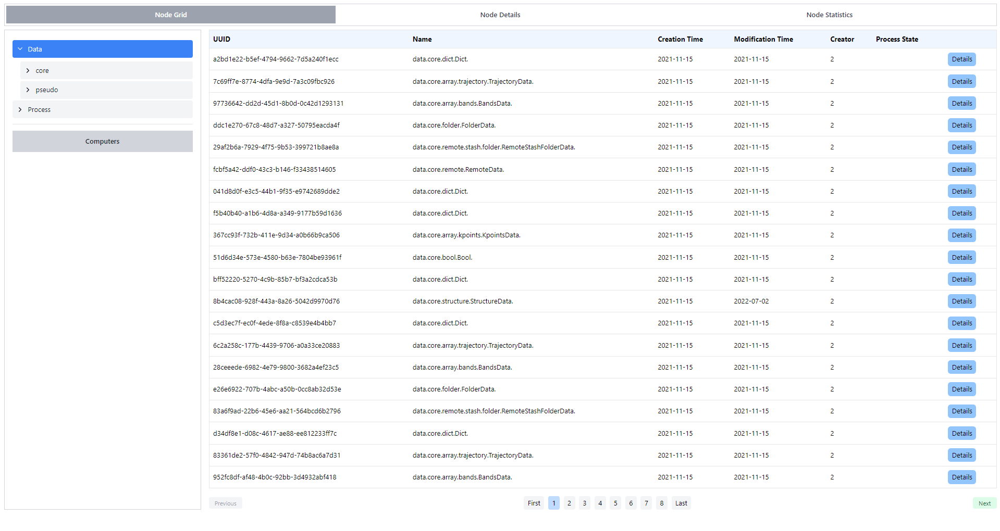
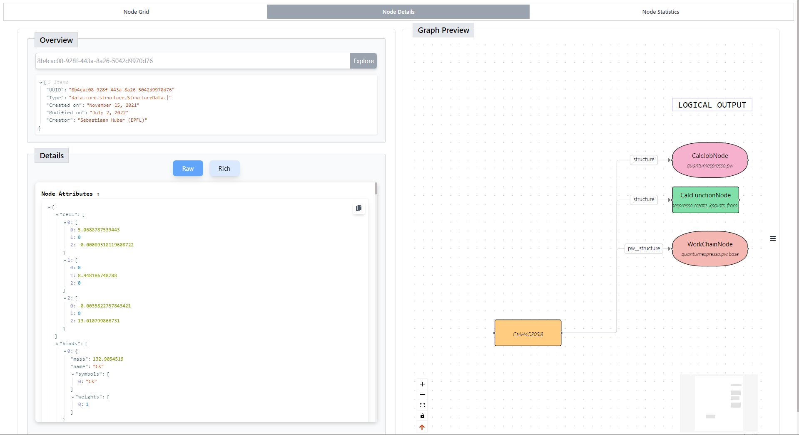

# Google Summer of Code 2024 Project Report

## Proposal Link
[AIIDA-GOOGLE SUMMER OF CODE 2024](https://docs.google.com/document/d/1VQOJ9eUC1KmGdjK3tjwNfsAXz1ttTVwR7MdOs2SziRA/edit?usp=sharing)

## GitHub Repository
[aiida-explorer](https://github.com/aiidateam/aiida-explorer)

### Mentors:
- Kristjan Eimre
- Edan Bainglass
- Xing Wang
- Jusong Yu

---

## Project Overview

The goal of this project is to build an easy-to-use tool in React for exploring AiiDA graphs. This tool will replace the old AiiDA Provenance Browser currently used in Materials Cloud Explore.

The new tool connects smoothly with AiiDA using a REST API, and it lets users:

- Explore graphs interactively.
- Easily see the difference between input and output nodes.
- View all the nodes connected to each other.
- Check out node details without needing to open a new page.

The final aim is to create a strong and user-friendly AiiDA node graph viewer. This viewer is being built with React and might even be published as a reusable component on the npm repository.

---

## Key Improvements Compared to the Previous Version

- **Updated User Interface:** 
  - The old interface was built with angular.js. We have now upgraded it to React, which makes the tool look and feel smoother and more responsive.

- **Better Features:** 
  - We've added new functions that were missing in the old version, so now users can do more with this tool.

- **Can Handle Larger Graphs:** 
  - The tool can now display more nodes at once, which is helpful for working with bigger and more complex graphs.

---

## Project Outcome

### Node Grid Component:

The Node Grid Component allows users to explore nodes by their types. Here’s what it can do:

- **Filter by Node Type:** You can choose to see only certain types of nodes, like data nodes, process nodes, or computer nodes.
- **Sort Nodes:** You can sort the nodes based on different fields.
- **Filter Section and Table:** On the left side of the image, you see the filter options. On the right side, there's a table that lists all the nodes that match the filter. 
- **Details Button:** Each node in the table has a button that takes you to the Node Details Page (described below).

### Node Details Page:

The Node Details Page shows all the important information about a node. You can view the node’s details in two ways: as raw data or in a rich view.

- **Left Side:** This part of the page shows all the node’s details, like general information, attributes, and extra data.
- **Right Side:** This part contains a graph that shows how the selected node is connected to other nodes. The nodes are arranged to make it easy to see different types of connections. If you click on another node in this graph, it will open that node's detail page.

### Statistics Section:

The Statistics section shows data about the AiiDA database, including general information about the nodes and details about the users who created them.

---

## Future Outlook

### Current Functionality:
Right now, the tool works well for looking at the local provenance view (the view that shows how nodes are connected within a small area). However, there are still some issues:

- **Graph Browser Bugs:** Sometimes the connections between nodes appear from the wrong side.
- **Data Loading Issues:** Occasionally, the data doesn’t load correctly.

### Future Goals:
In the future, we plan to add a global provenance view. This new feature will allow users to see how nodes are connected on a larger scale, not just within a small area.

---